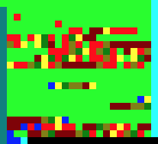

# Brainfuck

`Brainfuck.swift` is a flexible [Brainfuck](https://esolangs.org/wiki/Brainfuck) interpreter in Swift 3.1.

It comes with unit tests and tracing / debuging functions.

It also comes with a [Brainloller](https://esolangs.org/wiki/Brainloller) reader.

Brainfuck commands:

```
>	Move pointer right
<	Move pointer left
+	Increment memory under pointer
-	Decrement memory under pointer
.	Output value under pointer
,	Input value and store it under pointer
[	Jump past matching ] if value under pointer is 0
]	Jump back to matching [ if value under pointer is nonzero
```

Here are several ways to use Brainfuck.swift, given the following program:

```let helloWorld = "++++++++++[>+++++++>++++++++++>+++>+<<<<-]>++.>+.+++++++..+++.>++.<<+++++++++++++++.>.+++.------.--------.>+.>."```

## 1. Simple call

```Swift
let b = try! Brainfuck(helloWorld)
let result = try! b.run()
```

Result: `Hello World!\n`

## 2. Use optional parameters

```Swift
let b = try! Brainfuck(helloWorld, userInput: "", dataSize: 32)
let result = try! b.run()
```

Result: `Hello World!\n`

## 3. Call step by step

```Swift
do {
    let b = try Brainfuck(helloWorld)
    
    while b.canRun() {
        if let byte = try b.step() {
            print(byte)
        }
    }
} catch let e {
    print(e)
}
```

Output:

```
72
101
108
108
111
32
87
111
114
108
100
33
10
```

## 4. Print state at each step

```Swift
do {
    let b = try Brainfuck("++++++[>++++++<-]>.") // 6x6 == 0x24 == '$'
    
    while b.canRun() {
        print("-------------------------------------------------------------")
        b.printStep()
        b.printInstructions()
        b.printData(upToIndex: 10)
        
        if let putByte = try b.step() {
            print(" PUT: " + String(format: "%02X", putByte))
        }
    }
    
    print("-------------------------------------------------------------")
    b.printExecutionSummary()
    
} catch let e {
    print(e)
}
```

Output:

```
...
-------------------------------------------------------------
STEP: 73
PROG: ++++++[>++++++<-]>.
                       ^ 17
DATA: 00 24 00 00 00 00 00 00 00 00 00
      ^^ 0
-------------------------------------------------------------
STEP: 74
PROG: ++++++[>++++++<-]>.
                        ^ 18
DATA: 00 24 00 00 00 00 00 00 00 00 00
         ^^ 1
 PUT: 24
-------------------------------------------------------------
SUMMARY: program stopped after 75 step(s) with output:
    HEX: 24
    STR: $
```

## 5. Brainloller

[Brainloller](https://esolangs.org/wiki/Brainloller) stores Brainfuck commands in image pixels.

```Swift
let bl = try! Brainloller(imagePath: "/tmp/fibonacci.png")
let s1 = bl.brainfuck()
print(s1)

let bf = try! Brainfuck(s1)
let s2 = try! bf.run()
print(s2)
```
Output s1:

```
++++++++++++++++++++++++++++++++++++++++++++>++++++++++++++++++++++++++++++++>++++++++++++++++>>+<<[>>>>++++++++++<<[->+>-[>+>>]>[+[-<+>]>+>>]<<<<<<]>[<+>-]>[-]>>>++++++++++<[->-[>+>>]>[+[-<+>]>+>>]<<<<<]>[-]>>[++++++++++++++++++++++++++++++++++++++++++++++++.[-]]<[++++++++++++++++++++++++++++++++++++++++++++++++.[-]]<<<++++++++++++++++++++++++++++++++++++++++++++++++.[-]<<<<<<<.>.>>[>>+<<-]>[>+<<+>-]>[<+>-]<<<-]<<++...
```

Output s2:

`1, 1, 2, 3, 5, 8, 13, 21, 34, 55, 89, 144, 233, 121, 98, 219, ...`



Brainloller commands:

```
red        (255,0,0)	>
darkred    (128,0,0)	<
green      (0,255,0)	+
darkgreen  (0,128,0)	-
blue       (0,0,255)	.
darkblue   (0,0,128)	,
yellow     (255,255,0)	[
darkyellow (128,128,0)	]
cyan       (0,255,255)	rotates the IP 90° clockwise
darkcyan   (0,128,128)	rotates the IP 90° counter-clockwise
others     n/a          nop
```
